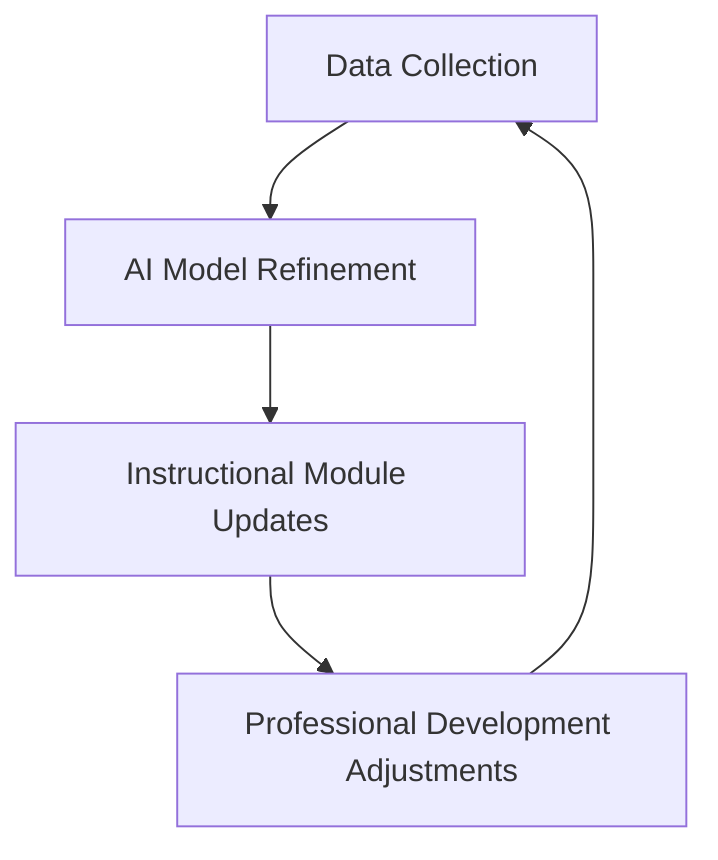

# AI-Enhanced Inquiry-Based Engineering Design (AI-IBED) National Implementation

> **Methodology for a Nationally Scalable, AI-Enabled Adaptive Learning Ecosystem**

---

## 🎯 **Overview**

This repository outlines the **engineering-design–driven, data-informed educational innovation methodology** for implementing **Inquiry by Engineering Design (IBED)** at a national scale. The approach integrates **inquiry-based computational modeling**, **artificial intelligence**, and **multi-level implementation science** to create an adaptive, scalable instructional system.

The methodology is grounded in **four core components**:

1. [Inquiry-Based Instructional Systems Engineering](#1-inquiry-based-instructional-systems-engineering)
2. [AI-Enabled Learning Analytics and Adaptive Instruction](#2-ai-enabled-learning-analytics-and-adaptive-instruction)
3. [Digital Pedagogy Integration](#3-digital-pedagogy-integration-and-technology-enhanced-inquiry-modeling)
4. [Implementation Science and Teacher Capacity Development](#4-implementation-science-and-scalable-teacher-capacity-development)
5. [Continuous Performance Evaluation](#5-continuous-performance-evaluation-and-instructional-optimization)
6. [National Scaling Through Partnerships](#6-national-scaling-through-strategic-education-and-technology-partnerships)

---

---

## 🔧 **1. Inquiry-Based Instructional Systems Engineering**

The instructional framework follows an **engineering design cycle** applied to education system development, with iterative phases:

- **Problem Definition**: Classroom and learning outcome data analysis to identify instructional gaps.
- **Prototype Design**: Development of IBED-aligned instructional modules.
- **Pilot Testing**: Real-world classroom deployment for empirical validation.
- **Performance Measurement**: Tracking engagement, achievement, and instructional efficiency metrics.
- **Iterative Redesign**: Refining modules based on data and stakeholder feedback.

**Key Features**:

- Embedded **inquiry-based modeling** (simulation, experimentation, computational modeling).
- **Digitized modules** for dynamic modification, adaptive scaffolding, and real-time feedback.

---

## 🤖 **2. AI-Enabled Learning Analytics and Adaptive Instruction**

AI models analyze and optimize learning pathways using:


| **Focus Area**        | **AI Application**                                         |
| --------------------- | ---------------------------------------------------------- |
| Student Engagement    | Pattern recognition for participation and interest levels. |
| Concept Mastery       | Progression tracking and mastery assessment.               |
| Inquiry Behavior      | Problem-solving pathway analysis.                          |
| Teacher Delivery      | Instructional style and effectiveness metrics.             |
| Classroom Variability | Performance trends across diverse environments.            |


**Outputs**:

- **Adaptive recommendations** for personalized learning.
- **Predictive early-warning systems** for disengagement.
- **Explainable AI (XAI)** for transparency and teacher trust.

**Tools**:

- **Instructional dashboards** for actionable insights (teachers, administrators, coaches).

---

## 💻 **3. Digital Pedagogy Integration and Technology-Enhanced Inquiry Modeling**

Digital tools are systematically integrated to support **hands-on inquiry** and **computational modeling**:

- **Simulation Platforms**: Visualize scientific/math phenomena (e.g., PhET, MATLAB).
- **Data Collection Tech**: Real-time experimental inquiry (e.g., sensors, IoT devices).
- **Digital Fabrication**: 3D printing, CAD tools for applied STEM design.
- **LMS Integration**: Hybrid/asynchronous instruction support (e.g., Moodle, Canvas).

**Design Principles**:

- Usability-driven, aligned with teacher workflows.
- Minimizes technology burden to maximize adoption.

---

## 👩‍🏫 **4. Implementation Science and Scalable Teacher Capacity Development**

Ensures **sustained adoption** across diverse educational settings:

- **Professional Development**: Aligned with classroom implementation phases.
- **Data-Informed Mentoring**: Uses instructional performance analytics.
- **Learning Communities**: Digital collaboration platforms (e.g., Slack, Microsoft Teams).
- **Adoption Readiness**: Targeted support for teachers at varying readiness levels.

**Model**:

- **Cascading Knowledge Transfer**: Trained educators mentor peers to accelerate regional adoption.

---

## 📊 **5. Continuous Performance Evaluation and Instructional Optimization**

Embedded **continuous improvement system** with:

- **Real-Time Dashboards**: Monitor instructional performance.
- **Longitudinal Tracking**: Student outcomes over time.
- **Teacher Retention/Effectiveness**: Metrics for sustainability.
- **Equity Monitoring**: Participation/performance across demographics.

**Optimization Cycle**:



---

## 🌍 **6. National Scaling Through Strategic Partnerships**

Phased expansion via collaborations with:

- **Academia**: Universities, STEM education research centers.
- **School Systems**: Districts, teacher preparation programs.
- **Government**: Federal STEM initiatives (e.g., NSF, Department of Education).
- **Industry**: EdTech infrastructure providers (e.g., Google for Education, AWS Educate).

**Deployment Strategy**:

- **Phased Rollout**: Pilot → Regional → National.
- **Scalability**: Digital platform infrastructure (cloud-based, open-access repositories).
- **Standardization**: Uniform implementation frameworks.

---

## 🚀 **Methodological Impact**

Transforms **IBED** into a:  
✅ **Nationally scalable** adaptive learning ecosystem.  
✅ **AI-driven** personalized instructional system.  
✅ **Data-optimized** framework for STEM education.  
✅ **Equitable** access to advanced STEM learning.

**Outcomes**:

- Improved **STEM instruction quality**.
- Increased **teacher retention**.
- Expanded **workforce development** alignment.

---

---

## 📌 **Getting Started**

### Prerequisites

- Familiarity with **IBED principles** and **STEM education frameworks**.
- Access to **digital tools** (LMS, simulation software, AI platforms).

### Installation

1. Clone this repository:
  ```bash
   git clone [https://github.com/Mofe-121/ai-ibed.git](https://github.com/Mofe-121/ai-ibed.git)
  ```
2. Review the [methodology documentation](#) for implementation guidelines.

### Contributing

Contributions are welcome! Please fork the repository and submit a pull request.

---

## 📜 **License**

This project is licensed under the **MIT License** – see the [LICENSE](LICENSE) file for details.

---

## 🙌 **Acknowledgments**

- Inspired by **NGSS**, **ISTE Standards**, and **AI4K12** initiatives.
- Supported by [Your Organization/Institution].
